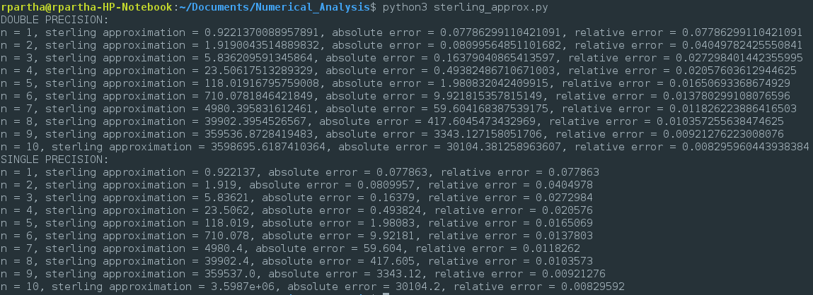

# Homework #1
Akhil Velagapudi (av481)  
Tarun Sreenathan (ts)  
Ramaseshan Parthasarathy(rp770)  

## Problem 1

Akhil

## Problem 2

Tarun

## Problem 3
The code to compute the sterling  approximation is as follows:

```python
import numpy as np
import math as math


# compute the sterling approximation for 
# double and single precision
def approximate_sterling(count):
	#initialize variabales
	fact = 1
	approx = None
	abserr = None
	relerr = None

	print("DOUBLE PRECISION: ")
	for n in range (1, count):
		fact  = fact * n
		approx = math.sqrt(2.0 * math.pi * n) * math.exp(-n) * math.pow(n, n)
		abserr = math.fabs(fact - approx)
		relerr = abserr/fact
		print("n = %s, sterling approximation = %s, absolute error = %s, relative error = %s" 
			   % (n, approx, abserr, relerr))

	#re-initialize variables
	fact = 1
	approx = None
	abserr = None
	relerr = None

	#single precision
	print("SINGLE PRECISION: ")
	for n in range (1, count):
		fact  = fact * n
		approx = np.float32(math.sqrt(2.0 * np.float32(math.pi) * n) * np.float32(math.exp(-n)) * math.pow(n, n))
		abserr = np.float32(math.fabs(fact - approx))
		relerr = np.float32(abserr/fact)	
		print("n = %s, sterling approximation = %s, absolute error = %s, relative error = %s" 
			   % (n, approx, abserr, relerr))

#execute method for n = 1,2,...,10
approximate_sterling(11) 
```

Running the above code would generate an output like so:



From the output, we can see that for both single and double precision, as *n* increases, the absolute error **increases** but the relative error **decreases**. Python3 defaults to double precision, so switching to single precision does not affect the ordering of the output. 

## Problem 4 

Akhil

## Problem 5

Tarun