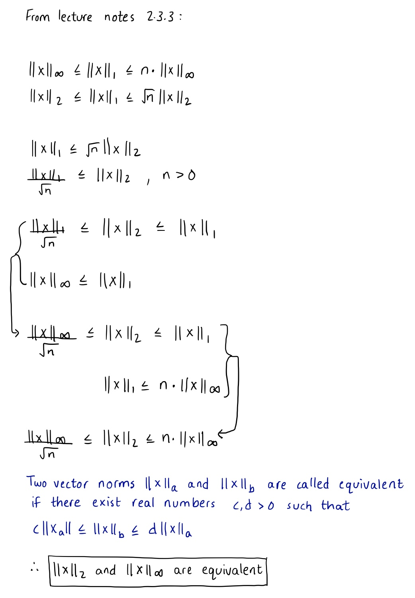
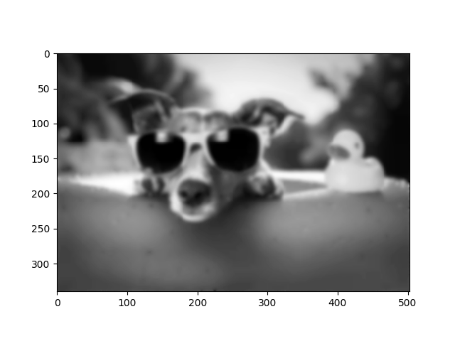

# Homework #1
Akhil Velagapudi

## Problem 1

### Errors:
```
a.
Absolute error: 0.14159265358979312
Relative error: 0.04507034144862795
b.
Absolute error: 0.0015926535897929917
Relative error: 0.0005069573828972128
c.
Absolute error: 0.0012644892673496777
Relative error: 0.0004024994347707008
```

### Code:
```Go
package main

import (
	"fmt"
	"math"
	"strconv"
)

func printFloat(text string, fl float64) {
	fmt.Println(text, strconv.FormatFloat(fl, 'f', -1, 64))
}

func absoluteError(value, approximation float64) float64 {
	return math.Abs(value - approximation)
}

func relativeError(value, approximation float64) float64 {
	return absoluteError(value, approximation) / math.Abs(value)
}

func main() {
	var pi, approximation float64

	pi = math.Pi

	approximation = 3
	fmt.Println("a.")
	printFloat("Absolute error:", absoluteError(pi, approximation))
	printFloat("Relative error:", relativeError(pi, approximation))

	approximation = 3.14
	fmt.Println("b.")
	printFloat("Absolute error:", absoluteError(pi, approximation))
	printFloat("Relative error:", relativeError(pi, approximation))

	approximation = 22.0 / 7.0
	fmt.Println("c.")
	printFloat("Absolute error:", absoluteError(pi, approximation))
	printFloat("Relative error:", relativeError(pi, approximation))
}
```


## Problem 2

By definition, machine epsilon is the smallest machine number that satisfies 1+ε≠1. However, it is not the smallest machine number that *can be stored on a computer* such that 1+ε≠1. For example, 2<sup>-24</sup> is the machine epsilon for single precision but 2<sup>-24</sup> can only be stored as 2<sup>-23</sup> or 0. On a double precision machine, 2<sup>-53</sup> is the smallest machine number that satisfies 1+ε≠1 but it can only be stored as 2<sup>-52</sup> (rounding up) or 0 (truncation).


## Problem 3

### Errors:
```
Single Precision:
n = 1    absolute error =     0.077862977981567          relative error = 0.077862977981567
n = 2    absolute error =     0.080995440483093          relative error = 0.040497720241547
n = 3    absolute error =     0.163790225982666          relative error = 0.027298370997111
n = 4    absolute error =     0.493822097778320          relative error = 0.020575920740763
n = 5    absolute error =     1.980812072753906          relative error = 0.016506767272949
n = 6    absolute error =     9.921752929687500          relative error = 0.013780212402344
n = 7    absolute error =    59.603027343750000          relative error = 0.011825997488839
n = 8    absolute error =   417.597656250000000          relative error = 0.010357084728423
n = 9    absolute error =  3343.062500000000000          relative error = 0.009212584049824
n = 10   absolute error = 30103.250000000000000          relative error = 0.008295648699295
Double precision:
n = 1    absolute error =     0.077862991104211          relative error = 0.077862991104211
n = 2    absolute error =     0.080995648511017          relative error = 0.040497824255508
n = 3    absolute error =     0.163790408654136          relative error = 0.027298401442356
n = 4    absolute error =     0.493824867106710          relative error = 0.020576036129446
n = 5    absolute error =     1.980832042409915          relative error = 0.016506933686749
n = 6    absolute error =     9.921815357815149          relative error = 0.013780299108077
n = 7    absolute error =    59.604168387539175          relative error = 0.011826223886417
n = 8    absolute error =   417.604547343296872          relative error = 0.010357255638475
n = 9    absolute error =  3343.127158051705919          relative error = 0.009212762230081
n = 10   absolute error = 30104.381258963607252          relative error = 0.008295960443938
```

### Code:
```python
import numpy as np
import math as math

def double_precision(count):
	fact = 1
	
	print("Double precision: ")
	for n in range (1, count):
		fact  = fact * n
		root = math.sqrt(2.0 * math.pi * n)
		approx = root * math.exp(-n) * n**n
		abserr = math.fabs(fact-approx)
		relerr = abserr/fact
		print("n = %i \t absolute error = %21.15f \t relative error = %17.15f" % (n, abserr, relerr))

def single_precision(count):
	fact = 1

	print("Single Precision: ")
	for n in range (1, count):
		n = np.float32(n)
		fact  = fact * n
		root = np.float32(math.sqrt(np.float32(2.0) * np.float32(math.pi) * n))
		approx = np.float32(root * np.float32(np.float32(math.e) ** -n) * np.float32(n**n))
		abserr = math.fabs(fact - approx)
		relerr = abserr/fact
		print("n = %i \t absolute error = %21.15f \t relative error = %17.15f" % (n, abserr, relerr))

single_precision(11)
double_precision(11)
```

As n increases, absolute error **increases** and relative error **decreases** for single precision and double precision. There is a small but negligible difference is results between single precision and double precision. This likely means that the driving force behind the approximation errors is Stirling's algorithm rather than machine rounding errors.

## Problem 4



## Problem 5

### Code:
```py
# blur.py
import numpy as np
import matplotlib.pyplot as plt
from PIL import Image
from scipy.sparse import lil_matrix

# read image file
fname = 'chill.jpg'
image = Image.open(fname).convert("L")
arr = np.asarray(image)
arr.setflags(write = 1)

# initialize blurring matrix
m = arr.shape[0]
n = arr.shape[1]
dofs = m*n
A = lil_matrix((dofs,dofs))
A.setdiag(np.ones(dofs))
for i in range(1,m-1):
    for j in range(1,n-1):
        A[n*i+j,n*i+j] = 8.0/16.
        A[n*i+j,n*(i-1)+j] = 1.0/16.
        A[n*i+j,n*(i-1)+(j-1)] = 1.0/16.
        A[n*i+j,n*(i-1)+(j+1)] = 1.0/16.
        A[n*i+j,n*i+j-1] = 1.0/16.
        A[n*i+j,n*i+j+1] = 1.0/16.
        A[n*i+j,n*(i+1)+j] = 1.0/16.
        A[n*i+j,n*(i+1)+(j-1)] = 1.0/16.
        A[n*i+j,n*(i+1)+(j+1)] = 1.0/16.
A = A.tocsr()

# Blurring function - converts image to a vector, multiplies by
# the blurring matrix, and copies the result back into the image
def blur():
    x = np.zeros(shape=(dofs,1))
    for i in range(0,m):
        for j in range(0,n):
            x[n*i+j] = arr[i,j]

    y = A.dot(x)
    for i in range(0,m):
        for j in range(0,n):
            arr[i,j] = y[n*i+j]

# Execute the blurring function 20 times
for i in range(0,20):
    blur()

# Display the blurred image
plt.imshow(arr,cmap='gray')
plt.show()
```

### Blurred Image:

