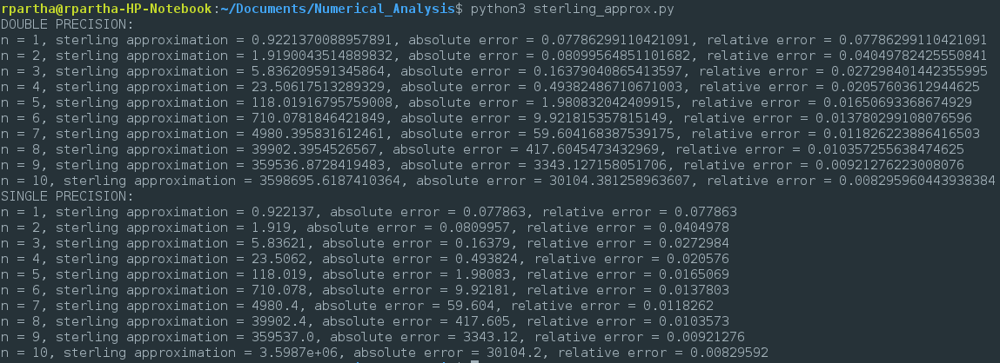
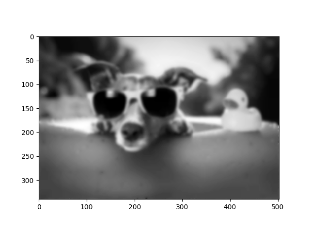

# Homework #1, 10/03/17
Ramaseshan Parthasarathy  
Akhil Velagapudi  
Tarun Sreenathan  

## Problem 1

### Code:
```python
import numpy as np
import math as math

def computeError(value, approx):
	absolute = np.float32(math.fabs(np.float32(value - approx)))
	relative = np.float32(math.fabs(np.float32(value - approx))/np.float32(math.fabs(value)))

	print("Absolute Error: %s" % (absolute))
	print("Relative Error: %s\n" % (relative))


print("a.")
computeError(np.float32(math.pi), np.float32(3))

print("b.")
computeError(np.float32(math.pi), np.float32(3.14))

print("c.")
computeError(np.float32(math.pi), np.float32(22/7.0))
```

### Errors:
```
Using single precision:

a.
Absolute error: 0.141593
Relative error: 0.0450704
b.
Absolute error: 0.00159264
Relative error: 0.000506952
c.
Absolute error: 0.00126433
Relative error: 0.00040245
```

## Problem 2

Machine epislon is stated to be the smallest ε such that 1 - ε < 1 < 1 + ε. It is the _smallest_ quantity representable by the computer and provides spacing between machine representable integers. In a single precision, it can store apprimxately 7 digits (≈ 2^23) while in double precision it can store up to 15 digits (≈ 2^56). During floating-point computations, the machine epsilon forms an upper bound on relative error. Thus, the inequality 1 + ε ≠ 1 holds true. 

## Problem 3
The code to compute the sterling  approximation is as follows:

```python
import numpy as np
import math as math

def power32(a, b):
	return np.float32(a ** b)

# compute the sterling approximation for 
# double and single precision
def approximate_sterling(count):
	#initialize variabales
	fact = 1
	approx = None
	abserr = None
	relerr = None

	print("DOUBLE PRECISION: ")
	for n in range (1, count):
		fact  = fact * n
		root = math.sqrt(2.0 * math.pi * n)
		expo = math.exp(-n)
		power = math.pow(n, n)
		approx = root * expo * power
		abserr = math.fabs(fact-approx)
		relerr = abserr/fact
		print("n = %s, sterling approximation = %s, absolute error = %s, relative error = %s" 
			   % (n, approx, abserr, relerr))

	#re-initialize variables
	fact = 1
	approx = None
	abserr = None
	relerr = None

	#single precision
	print("SINGLE PRECISION: ")
	
	for n in range (1, count):
		fact  = fact * n
		root = np.float32(math.sqrt(np.float32(np.float32(2.0) * np.float32(math.pi)) * np.float32(n)))
		expo = power32(np.float32(math.e), np.float32(-n))
		power = power32(np.float32(n), np.float32(n))
		approx = np.float32(np.float32(root * expo)) * power
		abserr = math.fabs(fact - approx)
		relerr = abserr/fact
		print("n = %s, sterling approximation = %s, absolute error = %s, relative error = %s" 
			   % (n, approx, abserr, relerr))

#execute method for n = 1,2,...,10
approximate_sterling(11)
```

Running the above code would generate an output like so:



From the output, we can see that for both single and double precision, as *n* increases, the absolute error **increases** but the relative error **decreases**. It can be seen that, for some odd reason, that the single precision that uses float32 is more precise than double precision (default to Python3) but remains unchanged. 

## Problem 4 

Akhil

## Problem 5

The modifieed code is as follows:

```python
# blur.py
import numpy as np
import matplotlib.pyplot as plt
from PIL import Image
from scipy.sparse import lil_matrix

# read image file
fname = 'chill.jpg'
image = Image.open(fname).convert("L")
arr = np.asarray(image)
arr.setflags(write = 1)

# initialize blurring matrix
m = arr.shape[0]
n = arr.shape[1]
dofs = m*n
A = lil_matrix((dofs,dofs))
A.setdiag(np.ones(dofs))
for i in range(1,m-1):
    for j in range(1,n-1):
        A[n*i+j,n*i+j] = 8./16.
        A[n*i+j,n*(i-1)+j] = 1./16.
        A[n*i+j,n*(i-1)+(j-1)] = 1./16.
        A[n*i+j,n*(i-1)+(j+1)] = 1./16.
        A[n*i+j,n*i+j-1] = 1./16.
        A[n*i+j,n*i+j+1] = 1./16.
        A[n*i+j,n*(i+1)+j] = 1./16.
        A[n*i+j,n*(i+1)+(j-1)] = 1./16.
        A[n*i+j,n*(i+1)+(j+1)] = 1./16.
A = A.tocsr()

# Blurring function - converts image to a vector, multiplies by
# the blurring matrix, and copies the result back into the image
def blur():
    x = np.zeros(shape=(dofs,1))
    for i in range(0,m):
        for j in range(0,n):
            x[n*i+j] = arr[i,j]

    y = A.dot(x)
    for i in range(0,m):
        for j in range(0,n):
            arr[i,j] = y[n*i+j]

# Execute the blurring function 20 times
for i in range(0,20):
    blur()

# Display the blurred image
plt.imshow(arr,cmap='gray')
plt.show()
```

This code results in the following output image:   


As opposed to the original code, which blurred the background but focused on the dog/duck, this code blurs the entire picture. It works in the same way in that the operation performed on the pixel replaces the grayscale value at every pixel by the weighted average of it's neighbors.  