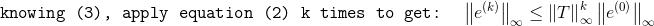
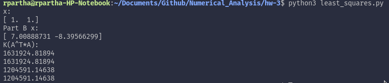

# Homework 3  

Ramaseshan Parthasarathy, Saurabh Prasad  
11/01/17

## Problem 1

1. The steps to show that the inequality holds is shown below:

     <br/> 
       
       

2. The proof is rather straight forward:

      

3. Using the previous part, the following can be shown:

       

4. Note that the fact that A is *diagonal dominant*, meaning every diagonal entry is greater than the sum of all other entries in its row

      

5. Combining steps 1 - 4 would use the following steps to arrive at the final inequality:

    

     <br/>

     <br/>

     

## Problem 2

```python
import numpy as np
import matplotlib.pyplot as plt

def Gaussian_Elimination(A):
    m=A.shape[0]
    n=A.shape[1]
    if(m!=n):
        print( 'Matrix is not square!');
        return
    for k in range(0,n-1):
        if A[k,k] == 0:
            return
        for i in range(k+1,n):
            A[i,k]=A[i,k]/A[k,k]
        for j in range(k+1,n):
            for i in range(k+1,n):
                A[i,j]-=A[i,k]*A[k,j]
				
def Back_Substitution(A,b,x):
    m=A.shape[0]
    n=A.shape[1]
    if(m!=n):
        print( 'Matrix is not square!')
        return
    for j in range(n-1,-1,-1):
        if A[j,j] == 0:
            print( 'Matrix is singular!')
            return          # matrix is singular
        x[j] = b[j]/A[j,j]
        for i in range(0,j):
            b[i] = b[i] - A[i,j]*x[j]
			
def Forward_Substitution(A,b,x):
    m=A.shape[0]
    n=A.shape[1]
    if(m!=n):
        print( 'Matrix is not square!')
        return
    for j in range(0,n):
        if A[j,j] == 0:
            print( 'Matrix is singular!')
            return          # matrix is singular
        x[j] = b[j]/A[j,j]
        for i in range(j+1,n):
            b[i] = b[i] - A[i,j]*x[j]

def main():
    t=np.array([0.,1.,2.,3.,4.,5.]);
    y=np.array([1.,2.7,5.8,6.6,7.5,9.9]);
    plt.figure(1);
    plt.plot(t,y,'ro')
    plt.title('Given data');
    plt.draw()

    for n in range(6):
    	
    	A=np.zeros((6,n+1));
    	
    	for r in range(6):
    		for c in range(A.shape[1]):
    			A[r,c]=t[r]**(A.shape[1]-1-c);
    	
    	x=np.zeros(A.shape[1]);
    	y1=np.zeros(A.shape[0]);
    	AtA=A.transpose().dot(A)
    	sol=A.transpose().dot(y)
    	
    	Gaussian_Elimination(AtA)
    	L=np.identity(AtA.shape[0])

    	for i in range(1,L.shape[0]):
    		for j in range(0,i):
    			L[i,j]=AtA[i,j];

    	U=np.zeros((AtA.shape[0],AtA.shape[1]))

    	for i in range(U.shape[0]):
    		for j in range(U.shape[1]-1,i-1,-1):
    			U[i,j]=AtA[i,j];
    	
    	Forward_Substitution(L,sol,y1)
    	Back_Substitution(U,y1,x)
    	x=np.array(x)
    	
    	print('n:',n)
    	print(x)

    	plt.figure(n+2);
    	plt.plot(t,A.dot(x),'k',t,y,'ro')
    	plt.title('n='+str(n));
    	plt.draw()
    plt.show()

if __name__ == "__main__":
    main()
```
The output plot(s) of the above program have been provided for convenience:

  
  
  
  
  
  
  

From the plots, it can, of course, be seen that polynomial with degree n = 5 displays the best trend for the data. 

## Problem 3

```python
import numpy as np

A=np.matrix([[.16,.1],[.17,.11],[2.02,1.29]])
b=np.matrix([[.26],[.28],[3.31]])

def Gaussian_Elimination(A):
    m=A.shape[0]
    n=A.shape[1]
    if(m!=n):
        print( 'Matrix is not square!');
        return
    for k in range(0,n-1):
        if A[k,k] == 0:
            return
        for i in range(k+1,n):
            A[i,k]=A[i,k]/A[k,k]
        for j in range(k+1,n):
            for i in range(k+1,n):
                A[i,j]-=A[i,k]*A[k,j]

def Back_Substitution(A,b,x):
    m=A.shape[0]
    n=A.shape[1]
    if(m!=n):
        print( 'Matrix is not square!')
        return
    for j in range(n-1,-1,-1):
        if A[j,j] == 0:
            print( 'Matrix is singular!')
            return          # matrix is singular
        x[j] = b[j]/A[j,j]
        for i in range(0,j):
            b[i] = b[i] - A[i,j]*x[j]
			
def Forward_Substitution(A,b,x):
    m=A.shape[0]
    n=A.shape[1]
    if(m!=n):
        print( 'Matrix is not square!')
        return
    for j in range(0,n):
        if A[j,j] == 0:
            print( 'Matrix is singular!')
            return          # matrix is singular
        x[j] = b[j]/A[j,j]
        for i in range(j+1,n):
            b[i] = b[i] - A[i,j]*x[j]
			
AtA=A.transpose().dot(A)
Atb=A.transpose().dot(b)

Gaussian_Elimination(AtA)

L=np.identity(AtA.shape[0])

for i in range(1,L.shape[0]):
	for j in range(0,i):
		L[i,j]=AtA[i,j];

U=np.zeros((AtA.shape[0],AtA.shape[1]))

for i in range(U.shape[0]):
	for j in range(U.shape[1]-1,i-1,-1):
		U[i,j]=AtA[i,j];
		
AtbVector=np.array(Atb[:,0])
y=np.zeros(A.shape[1])
x=np.zeros(A.shape[1])
Forward_Substitution(L,AtbVector,y)
Back_Substitution(U,y,x)
print('x:')
print(x)

#Part B
b=np.matrix([[.27],[.25],[3.33]])
AtA=A.transpose().dot(A)
Atb=A.transpose().dot(b)

Gaussian_Elimination(AtA)

L=np.identity(AtA.shape[0])

for i in range(1,L.shape[0]):
	for j in range(0,i):
		L[i,j]=AtA[i,j];

U=np.zeros((AtA.shape[0],AtA.shape[1]))

for i in range(U.shape[0]):
	for j in range(U.shape[1]-1,i-1,-1):
		U[i,j]=AtA[i,j];
		
AtbVector=np.array(Atb[:,0])
y=np.zeros(A.shape[1])
x=np.zeros(A.shape[1])
Forward_Substitution(L,AtbVector,y)
Back_Substitution(U,y,x)
print('Part B x:')
print(x)

print('K(A^T*A):')
print(np.linalg.cond(A.transpose().dot(A)))
```

The solutions to the systems in part a and b have been given below:



The output shows vast difference in sooluttions for small variance in b vector. This could likely be due to the vast difference in the condition numbers when using the L<sub>2</sub> and L<sub>1</sub> = L<sub>$\infty$</sub> norm. The matrices in either case appear to be well conditioned. 

## Problem 4

1. The matrix *A* in question is shown below. We can prove that *A* is singular by proving that *A* is not invertible since singular matrices, by definition, do not have inverses.  

      

    The determinant can be computed by expanding from the first row:  

      

    Knowing that *A* is singular, we can attempt to solve the system *Ax* = *b* below by first setting up the augmented matrix *A&#42;*:

     

    The following steps outline the row operations that can be performed on this matrix:

      

    

    We can conclude, based upon the zero in the last column of *A&#42;*, that *A* and *b* are of the same rank. That tells us that the matrix is consistent and has an infinite amount of solutions. We can therefore arrive at a solution by picking an arbitrary *x*<sub>3</sub> and performing backward substitution. The result is as follows:

    

2. Using Gaussian Elimination with partial pivoting using exact arithmetic, the process would fail at the second iteration, at which point there are zero entries in the last row of *A&#42;*. This process was briefly outlined in the previous part.

3. The code below computes the solution to the matrix as well as the condition number:

    ```python
    import numpy as np
    from numpy import linalg as linalg

    def gauss_elim(A):
        m=A.shape[0]
        n=A.shape[1]
        U = np.zeros((m,n))
        L = np.zeros((m,n))

        if(m!=n):
            print('Not Square Matrix')
            return

        for k in range(0, n-1):
            if A[k,k] == 0:
                return
            for i in range(k+1, n):
                A[i,k] = A[i,k] / A[k,k]
            for j in range (k+1, n):
                for i in range (k+1, n):
                    A[i,j] -= A[i,k] * A[k,j]

        L = np.tril(A,0)
        for kk in range(n):
            for i in range(kk+1, n):
                L[kk,kk] = 1
        L[kk,kk]=1

        U = np.triu(A,0)

        return (L,U)

    def forward_sub(A,b,x):
        m=A.shape[0]
        n=A.shape[1]
        if(m!=n):
            print 'Matrix is not square!'
            return
        for j in range(0,n):
            #if A[j,j] == 0:
            #	print 'Matrix is singular!'
            #	return          # matrix is singular
            x[j] = b[j]/A[j,j]
            for i in range(j+1,n):
                b[i] = b[i] - A[i,j]*x[j]

    def back_sub(A,b,x):
        m=A.shape[0]
        n=A.shape[1]
        if(m!=n):
            print 'Matrix is not square!'
            return
        for j in range(n-1,-1,-1):
            #if A[j,j] == 0:
            #	print 'Matrix is singular!'
            #	return          # matrix is singular
            x[j] = b[j]/A[j,j]
            for i in range(0,j):
                b[i] = b[i] - A[i,j]*x[j]


    def main():
        A = np.matrix([[0.1,0.2,0.3],[0.4,0.5,0.6],[0.7,0.8,0.9]])
        A_inv = np.linalg.inv(A)
        b = np.array([0.1,0.3,0.5])

        k_cond = np.linalg.cond(A)

        x = np.zeros(3)
        y = np.zeros(3)

        L,U = gauss_elim(A)
        forward_sub(L,b,y)
        back_sub(U,y,x)

        print (x)
        print 'condition number: ', k_cond
        print(np.finfo(float).eps)

    if __name__ == "__main__":
        main()

    ```

    The output of the above code is as follows:

    

    What's interesting to point out is that the solution does match the description answered in part 1. Our small calculations indicated that the system could have one of infinite solutions. The computed solution gave us one such solution in the form of a 3x1 vector and a condition number of 2.11189683358e+16 was estimated. It should be duely noted that machine epislon is typically on the order of 10<sup>-16</sup> (which can easily be found using np.finfo(float).eps), where as our computation resulted in an order of 10<sup>+16</sup>. 