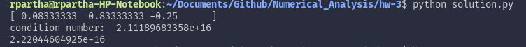

# Homework 3
# Ramaseshan Parthasarathy, Saurabh Prasad

## Problem 1

## Problem 2

```python
import numpy as np
import matplotlib.pyplot as plt

def Gaussian_Elimination(A):
    m=A.shape[0]
    n=A.shape[1]
    if(m!=n):
        print( 'Matrix is not square!');
        return
    for k in range(0,n-1):
        if A[k,k] == 0:
            return
        for i in range(k+1,n):
            A[i,k]=A[i,k]/A[k,k]
        for j in range(k+1,n):
            for i in range(k+1,n):
                A[i,j]-=A[i,k]*A[k,j]
				
def Back_Substitution(A,b,x):
    m=A.shape[0]
    n=A.shape[1]
    if(m!=n):
        print( 'Matrix is not square!')
        return
    for j in range(n-1,-1,-1):
        if A[j,j] == 0:
            print( 'Matrix is singular!')
            return          # matrix is singular
        x[j] = b[j]/A[j,j]
        for i in range(0,j):
            b[i] = b[i] - A[i,j]*x[j]
			
def Forward_Substitution(A,b,x):
    m=A.shape[0]
    n=A.shape[1]
    if(m!=n):
        print( 'Matrix is not square!')
        return
    for j in range(0,n):
        if A[j,j] == 0:
            print( 'Matrix is singular!')
            return          # matrix is singular
        x[j] = b[j]/A[j,j]
        for i in range(j+1,n):
            b[i] = b[i] - A[i,j]*x[j]

def main():
    t=np.array([0.,1.,2.,3.,4.,5.]);
    y=np.array([1.,2.7,5.8,6.6,7.5,9.9]);
    plt.figure(1);
    plt.plot(t,y,'ro')
    plt.title('Given data');
    plt.draw()

    for n in range(6):
    	
    	A=np.zeros((6,n+1));
    	
    	for r in range(6):
    		for c in range(A.shape[1]):
    			A[r,c]=t[r]**(A.shape[1]-1-c);
    	
    	x=np.zeros(A.shape[1]);
    	y1=np.zeros(A.shape[0]);
    	AtA=A.transpose().dot(A)
    	sol=A.transpose().dot(y)
    	
    	Gaussian_Elimination(AtA)
    	L=np.identity(AtA.shape[0])

    	for i in range(1,L.shape[0]):
    		for j in range(0,i):
    			L[i,j]=AtA[i,j];

    	U=np.zeros((AtA.shape[0],AtA.shape[1]))

    	for i in range(U.shape[0]):
    		for j in range(U.shape[1]-1,i-1,-1):
    			U[i,j]=AtA[i,j];
    	
    	Forward_Substitution(L,sol,y1)
    	Back_Substitution(U,y1,x)
    	x=np.array(x)
    	
    	print('n:',n)
    	print(x)

    	plt.figure(n+2);
    	plt.plot(t,A.dot(x),'k',t,y,'ro')
    	plt.title('n='+str(n));
    	plt.draw()
    plt.show()

if __name__ == "__main__":
    main()
```

## Problem 3

```python
import numpy as np

A=np.matrix([[.16,.1],[.17,.11],[2.02,1.29]])
b=np.matrix([[.26],[.28],[3.31]])

def Gaussian_Elimination(A):
    m=A.shape[0]
    n=A.shape[1]
    if(m!=n):
        print( 'Matrix is not square!');
        return
    for k in range(0,n-1):
        if A[k,k] == 0:
            return
        for i in range(k+1,n):
            A[i,k]=A[i,k]/A[k,k]
        for j in range(k+1,n):
            for i in range(k+1,n):
                A[i,j]-=A[i,k]*A[k,j]

def Back_Substitution(A,b,x):
    m=A.shape[0]
    n=A.shape[1]
    if(m!=n):
        print( 'Matrix is not square!')
        return
    for j in range(n-1,-1,-1):
        if A[j,j] == 0:
            print( 'Matrix is singular!')
            return          # matrix is singular
        x[j] = b[j]/A[j,j]
        for i in range(0,j):
            b[i] = b[i] - A[i,j]*x[j]
			
def Forward_Substitution(A,b,x):
    m=A.shape[0]
    n=A.shape[1]
    if(m!=n):
        print( 'Matrix is not square!')
        return
    for j in range(0,n):
        if A[j,j] == 0:
            print( 'Matrix is singular!')
            return          # matrix is singular
        x[j] = b[j]/A[j,j]
        for i in range(j+1,n):
            b[i] = b[i] - A[i,j]*x[j]
			
AtA=A.transpose().dot(A)
Atb=A.transpose().dot(b)

Gaussian_Elimination(AtA)

L=np.identity(AtA.shape[0])

for i in range(1,L.shape[0]):
	for j in range(0,i):
		L[i,j]=AtA[i,j];

U=np.zeros((AtA.shape[0],AtA.shape[1]))

for i in range(U.shape[0]):
	for j in range(U.shape[1]-1,i-1,-1):
		U[i,j]=AtA[i,j];
		
AtbVector=np.array(Atb[:,0])
y=np.zeros(A.shape[1])
x=np.zeros(A.shape[1])
Forward_Substitution(L,AtbVector,y)
Back_Substitution(U,y,x)
print('x:')
print(x)

#Part B
b=np.matrix([[.27],[.25],[3.33]])
AtA=A.transpose().dot(A)
Atb=A.transpose().dot(b)

Gaussian_Elimination(AtA)

L=np.identity(AtA.shape[0])

for i in range(1,L.shape[0]):
	for j in range(0,i):
		L[i,j]=AtA[i,j];

U=np.zeros((AtA.shape[0],AtA.shape[1]))

for i in range(U.shape[0]):
	for j in range(U.shape[1]-1,i-1,-1):
		U[i,j]=AtA[i,j];
		
AtbVector=np.array(Atb[:,0])
y=np.zeros(A.shape[1])
x=np.zeros(A.shape[1])
Forward_Substitution(L,AtbVector,y)
Back_Substitution(U,y,x)
print('Part B x:')
print(x)

print('K(A^T*A):')
print(np.linalg.cond(A.transpose().dot(A)))
```

## Problem 4

1. The matrix *A* in question is shown below. We can prove that *A* is singular by proving that *A* is not invertible since singular matrices, by definition, do not have inverses.  

<a href="https://www.codecogs.com/eqnedit.php?latex=A&space;=&space;\begin{bmatrix}&space;0.1&space;&&space;0.2&space;&&space;0.3\\&space;0.4&space;&&space;0.5&space;&&space;0.6\\&space;0.7&space;&&space;0.8&space;&&space;0.9&space;\end{bmatrix}" target="_blank"></a>  

The determinant can be computed by expanding from the first row:  

<a href="https://www.codecogs.com/eqnedit.php?latex=\inline&space;0.1(0.45-0.48)&space;-&space;0.2(0.36&space;-&space;0.42)&space;&plus;&space;0.3(0.32&space;-&space;0.45)&space;=&space;0" target="_blank"></a>  

Knowing that *A* is singular, we can attempt to solve the system *Ax* = *b* below by first setting up the augmented matrix *A&#42;*:

<a href="https://www.codecogs.com/eqnedit.php?latex=\inline&space;A^{*}&space;=&space;[A|b]&space;=&space;\begin{bmatrix}&space;\left.\begin{matrix}&space;0.1&space;&&space;0.2&space;&&space;0.3&space;\hspace{1mm}&space;\\&space;0.4&space;&&space;0.5&space;&&space;0.6&space;\hspace{1mm}&space;\\&space;0.7&space;&&space;0.8&space;&&space;0.9&space;\hspace{1mm}&space;\end{matrix}\right|\begin{matrix}&space;0.1&space;\\&space;0.3\\&space;0.5&space;\end{matrix}&space;\end{bmatrix}" target="_blank"></a> 

The following steps outline the row operations that can be performed on this matrix:

<a href="https://www.codecogs.com/eqnedit.php?latex=\inline&space;(1)&space;\begin{bmatrix}&space;\left.\begin{matrix}&space;0.1&space;&&space;0.2&space;&&space;0.3&space;\hspace{1mm}&space;\\&space;0.4&space;&&space;0.5&space;&&space;0.6&space;\hspace{1mm}&space;\\&space;0.7&space;&&space;0.8&space;&&space;0.9&space;\hspace{1mm}&space;\end{matrix}\right|\begin{matrix}&space;0.1&space;\\&space;0.3\\&space;0.5&space;\end{matrix}&space;\end{bmatrix}&space;\xrightarrow[R_{3}&space;\hspace{1mm}&space;\rightarrow&space;\hspace{1mm}&space;R_{3}&space;\hspace{1mm}&space;-&space;\hspace{1mm}7R_{1}]{R_{2}&space;\hspace{1mm}&space;\rightarrow&space;\hspace{1mm}&space;R_{2}&space;\hspace{1mm}&space;-&space;\hspace{1mm}4R_{1}}&space;\begin{bmatrix}&space;\left.\begin{matrix}&space;0.1&space;&&space;0.2&space;&&space;0.3&space;\hspace{1mm}&space;\\&space;0&space;&&space;-0.3&space;&&space;-0.6&space;\hspace{1mm}&space;\\&space;0&space;&&space;-0.6&space;&&space;-1.2&space;\hspace{1mm}&space;\end{matrix}\right|\begin{matrix}&space;0.1&space;\\&space;-0.1\\&space;-0.2&space;\end{matrix}&space;\end{bmatrix}" target="_blank"></a>  

<a href="https://www.codecogs.com/eqnedit.php?latex=\inline&space;(2)&space;\begin{bmatrix}&space;\left.\begin{matrix}&space;0.1&space;&&space;0.2&space;&&space;0.3&space;\hspace{1mm}&space;\\&space;0&space;&&space;-0.3&space;&&space;-0.6&space;\hspace{1mm}&space;\\&space;0&space;&&space;-0.6&space;&&space;-1.2&space;\hspace{1mm}&space;\end{matrix}\right|\begin{matrix}&space;0.1&space;\\&space;-0.1\\&space;-0.2&space;\end{matrix}&space;\end{bmatrix}&space;\xrightarrow[]{R_{3}&space;\hspace{1mm}&space;\rightarrow&space;\hspace{1mm}&space;R_{3}&space;\hspace{1mm}&space;-&space;\hspace{1mm}2R_{2}}&space;\begin{bmatrix}&space;\left.\begin{matrix}&space;0.1&space;&&space;0.2&space;&&space;0.3&space;\hspace{1mm}&space;\\&space;0&space;&&space;-0.3&space;&&space;-0.6&space;\hspace{1mm}&space;\\&space;0&space;&&space;0&space;&&space;0&space;\hspace{1mm}&space;\end{matrix}\right|\begin{matrix}&space;0.1&space;\\&space;-0.1\\&space;0&space;\end{matrix}&space;\end{bmatrix}" target="_blank"></a>

We can conclude, based upon the zero in the last column of *A&#42;*, that *A* and *b* are of the same rank. That tells us that the matrix is consistent and has an infinite amount of solutions. We can therefore arrive at a solution by picking an arbitrary *x*<sub>3</sub> and performing backward substitution. The result is as follows:

<a href="https://www.codecogs.com/eqnedit.php?latex=\inline&space;x&space;=&space;\begin{bmatrix}&space;1/3\\&space;1/3&space;\\&space;0&space;\end{bmatrix}&space;&plus;&space;x_{3}\begin{bmatrix}&space;1\\-2&space;\\1&space;\end{bmatrix}" target="_blank"></a>

2. Using Gaussian Elimination with partial pivoting using exact arithmetic, the process would fail at the second iteration, at which point there are zero entries in the last row of *A&#42;*. This process was briefly outlined in the previous part.

3. The code below computes the solution to the matrix as well as the condition number:

    ```python
        import numpy as np
        from numpy import linalg as linalg

        def main():
            A = np.array([[0.1,0.2,0.3],[0.4,0.5,0.6],[0.7,0.8,0.9]])
            b = np.array([0.1,0.3,0.5])

            x= np.linalg.solve(A,b)
            k_cond = np.linalg.cond(A)

            print x
            print 'condition number: ', k_cond

        if __name__ == "__main__":
            main()
    ```

    The output of the above code is as follows:

    

    What's interesting to point out is that the solution does match the description answered in part 1. Our small calculations indicated that the system could have one of infinite solutions. The computed solution gave us one such solution in the form of a 3x1 vector and a condition number of 2.11189683358e+16 was estimated. It should be duely noted that machine epislon is typically on the order of 10<sup>-16</sup> (which can easily be found using np.finfo(float).eps), where as our computation resulted in an order of 10<sup>+16</sup>. 