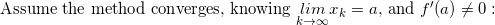
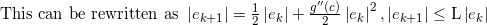

# Homework 4
Ramaseshan Parthasarathy, Saurabh Prasad

## Problem 1

1. The method does converge to f(x) = 0:    
      
      
      

2. This method does converge under the same conditions as Newton's method:  
        
        
      
      
         
       
       

3. The order of convergence is 1:  
        
        
      


## Problem 2

1. Analysis of convergence properties:  
            
          
       
      
      

2. Verifying my analysis:   


## Problem 3

The code for Bisection, Secant, and Newton methods for solving 1-D nonlinear equations is given below:

```python
import numpy as np
import math
maxIterations=1000000
threshold=0.00001
def f1(x):
	return x**3-2*x-5.
def f1prime(x):
	return 3.*x**2-2
def f2(x):
	return math.exp(-x)-x
def f2prime(x):
	return -math.exp(-x)-1
def f3(x):
	return x*math.sin(x)-1.
def f3prime(x):
	return x*math.cos(x)+math.sin(x)
def f4(x):
	return x**3-3.*x**2+3.*x-1.
def f4prime(x):
	return 3*x**2-6*x+3

def Newton(f,fprime,x0):
	x=x0
	sol=np.zeros(100) #Create array of computed solutions
	sol[0]=x
	xnew=x-f(x)/fprime(x) # Compute first iteration
	iterations=1
	sol[iterations]=xnew
	while(math.fabs(x-xnew)>threshold and iterations<maxIterations):
		x=xnew
		xnew=x-f(x)/fprime(x)
		iterations+=1
		sol[iterations]=xnew
	
	ek=np.zeros(iterations);
	for i in range(iterations):
		ek[i]=math.log10(math.fabs(xnew-sol[i])) # Compute error at each iteration
	z=np.polyfit(ek[0:ek.shape[0]-1],ek[1:ek.shape[0]],1) # Fit line through (x,y)->(log|e(k)|,log|e(k+1)|)
	print('Order of convergence',z[0])
	print('Iterations=',iterations)
	return xnew
	
def Secant(f,x1,x0):
	sol=np.zeros(100)#Create array of computed solutions
	xold=x1
	xoldest=x0
	sol[0]=xoldest
	sol[1]=xold
	iterations=2
	xnew=xold-(f(xold)/(f(xold)-f(xoldest)))/(xold-xoldest)# Compute first iteration
	sol[iterations]=xnew
	while(math.fabs(xnew-xold)>threshold and iterations<maxIterations):
		xoldest=xold
		xold=xnew
		xnew=xold-f(xold)/((f(xold)-f(xoldest))/(xold-xoldest))
		iterations+=1
		sol[iterations]=xnew

	ek=np.zeros(iterations);
	for i in range(iterations):
		ek[i]=math.log10(math.fabs(xnew-sol[i]))# Compute error at each iteration
	z=np.polyfit(ek[0:ek.shape[0]-1],ek[1:ek.shape[0]],1)# Fit line thru (x,y)->(log|e(k)|,log|e(k+1)|)
	print('Order of convergence',z[0])
	print('Iterations=',iterations)
	return xnew

def bisect(f,low,high):
	iterations=0;
	sol=np.zeros(100)#Create array of computed solutions
	while(low<=high and iterations<maxIterations):
		mid=(low*(1.)+high*(1.))/2. # Compute midpoint of interval
		sol[iterations]=mid
		if math.fabs(f(mid))<threshold:
			low=high+1
		elif f(mid)*f(low)<0:
			high=mid
		else:
			low=mid
		iterations+=1

	ek=np.zeros(iterations);
	for i in range(iterations):
		if not math.fabs(mid-sol[i])==0:
			ek[i]=math.log10(math.fabs(mid-sol[i]))# Compute error at each iteration
		else:
			ek[i]=threshold
	z=np.polyfit(ek[0:ek.shape[0]-1],ek[1:ek.shape[0]],1)# Fit line through (x,y)->(log|e(k)|,log|e(k+1)|)
	print('Order of convergence',z[0])
	print('Iterations=',iterations)
	return mid;

print("Newton's method on problem 1")
sol=Newton(f1,f1prime,1)
print('x=',sol)

print("Secant method on problem 1")
sol=Secant(f1,1.1,1.)
print('x=',sol)

print("Bisection method on problem 1")
sol=bisect(f1,0,5)
print('x=',sol)
```

## Problem 4

        
      
      
