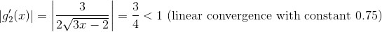
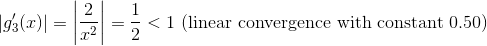

# Homework 4
Ramaseshan Parthasarathy, Saurabh Prasad

## Problem 1

## Problem 2

1. Analysis of convergence properties:  
            
          
       
         

## Problem 3

## Problem 4

        
      
      
