# Homework 5
Ramaseshan Parthasarathy, Ashwin Sethi

## Problem 1
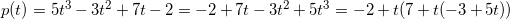

## Problem 2

### Part A
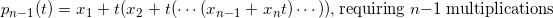 

### Part B
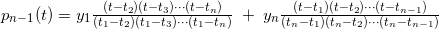  
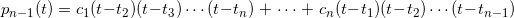  
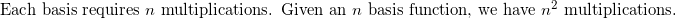

### Part C
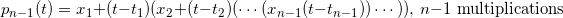

## Problem 3

### Part A
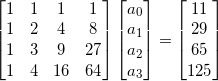  

### Part B
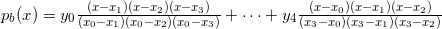  
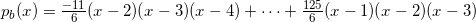  
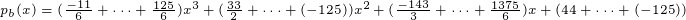

### Part C

#### Triangular Matrix

#### Incremental Interpolation

#### Divided Differences

## Problem 4

### Part A
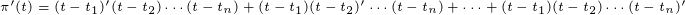    
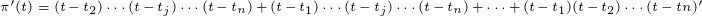  
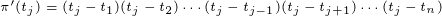

### Part B
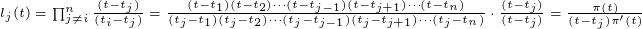    

## Problem 5 (Extra Credit)
