# Homework 5
Ramaseshan Parthasarathy, Ashwin Sethi

## Problem 1

## Problem 2

### Part A
 

### Part B
  
  

### Part C

## Problem 3

### Part A
  

### Part B
  
  
  
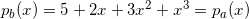

### Part C

#### Triangular Matrix
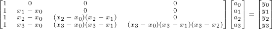  
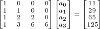  
  
  
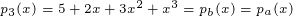

#### Incremental Interpolation
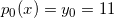  
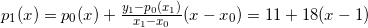  
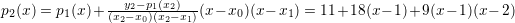  
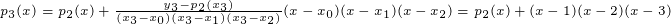  
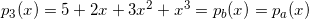

#### Divided Differences
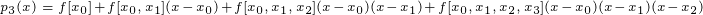  
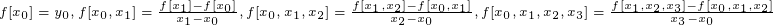  
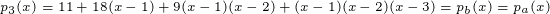 

## Problem 4

### Part A
    
  

### Part B
    

## Problem 5 (Extra Credit)
